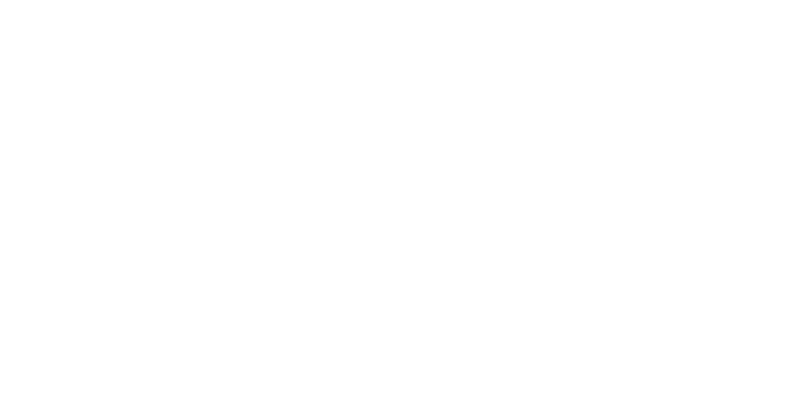

<picture></picture>

laminal softworks is an independent software organization focused on building 
high-performance tools, developer infrastructure, and experimental systems.

## flagship projects
- **razator**: next-generation upcoming lua(u) obfuscation and optimization tooling

## principles
- simple designs over unnecessary complexity
- performance without sacrificing correctness
- software built to last

## contributing
contributions, discussions, and ideas are welcome. individual projects may have
their own contribution guidelines.

## links
- discord: https://discord.gg/smRCdt9Dpm
